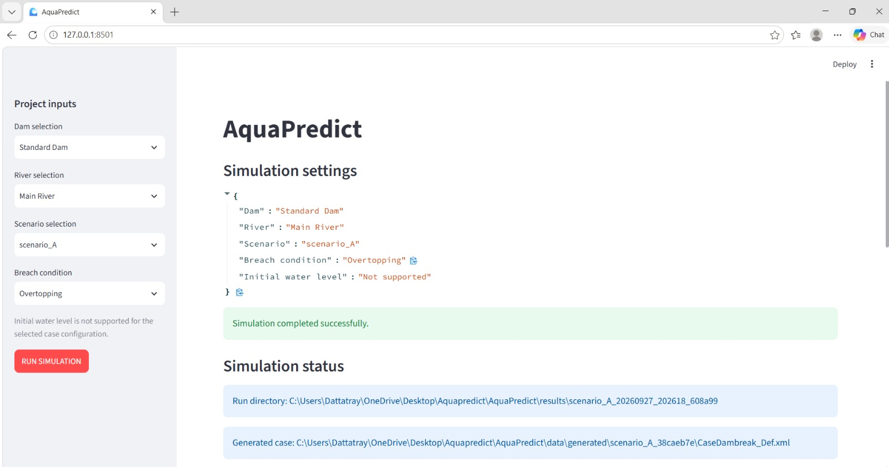
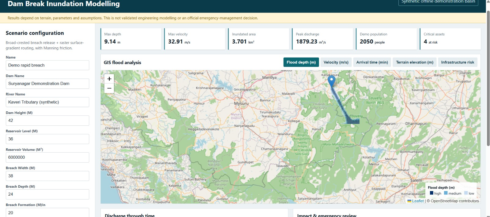
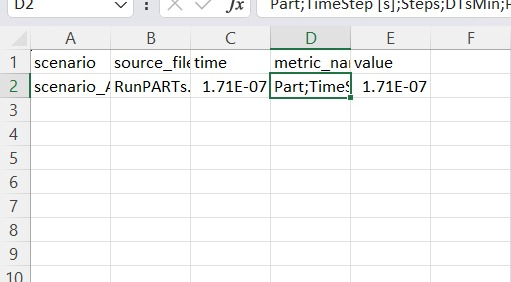
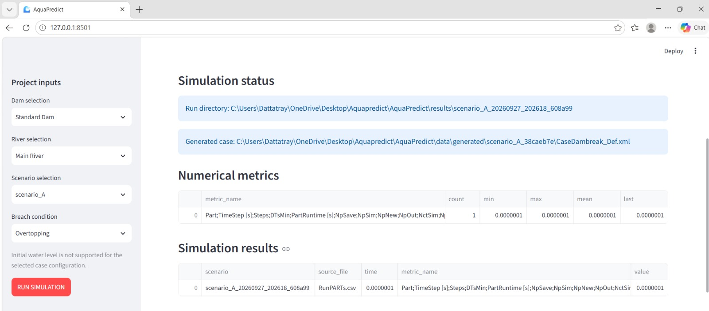

# AquaPredict

Dam-break inundation modelling with a particle-based hydrodynamic solver (DualSPHysics) and a GIS-style dashboard for reading the results.

Built by **Team PROTONIC** for Smart India Hackathon 2026.
Problem Statement **SIH26161**: *Dam Break Inundation Modelling Using Hydrodynamic Modelling of any River* (Disaster Management, Software).

> **Prototype status:** this is a working prototype of the simulation pipeline and the results dashboard. The two parts are not yet connected end to end, and the dashboard currently runs on a synthetic demonstration basin. See [Current status](#current-status) for exactly what works and what doesn't.

---

## Why we built this

When a dam fails or a river gets blocked, the people responsible for evacuation need answers quickly: which areas go under, how deep, how fast the water moves, and how much time is left before it arrives. Running a hydrodynamic model for every "what if" is slow and usually needs an expert on hand.

AquaPredict's aim is to make that loop shorter. You describe the dam, the river and the breach, the system builds the solver case, runs it, and presents the outcome as maps and numbers a decision-maker can read.

## What is in this repo

The prototype has two working components.

### 1. Simulation runner (Streamlit)

A small web app (`streamlit_app.py`) where you choose a dam, a river, a scenario and a breach condition (for example, overtopping). When you press **Run Simulation** it:

1. writes the selection to a settings record,
2. generates a DualSPHysics case definition (`CaseDambreak_Def.xml`) for that scenario,
3. runs the solver,
4. collects the solver's run statistics into a timestamped folder under `results/`.

Every run gets its own directory, so scenarios can be compared later without overwriting each other.

### 2. Dam-break dashboard (`dam-break-simulation/`)

A browser dashboard for inspecting a breach scenario. You set the dam height, reservoir level and volume, breach width, depth and formation time, and it shows:

- summary cards: max depth, max velocity, inundated area, peak discharge, exposed population, critical assets at risk
- map layers: flood depth, velocity, arrival time, terrain elevation, infrastructure risk
- a discharge-through-time chart and an impact review panel

The routing here is a simplified model: a broad-crested breach release, then raster surface-gradient routing with Manning friction. It is meant for fast exploration, not as a substitute for a full hydrodynamic run.

## Screenshots

**Simulation runner: scenario selection and run status**

<!-- PASTE IMAGE 1 HERE: Streamlit page with "Simulation settings" JSON and "Simulation completed successfully" -->


**Dam-break dashboard: flood depth layer**

<!-- PASTE IMAGE 2 HERE: dashboard with the map, the blue flood path and the summary cards -->


**Solver output as written by DualSPHysics (`RunPARTs.csv`)**

<!-- PASTE IMAGE 3 HERE: the Excel view of the results CSV -->


**Simulation results table inside the runner**

<!-- PASTE IMAGE 4 HERE: Streamlit "Numerical metrics" and "Simulation results" tables -->


## Architecture

The design we are building towards has two layers:

```
Monitoring layer (light, always on)          Simulation layer (only on trigger)
-----------------------------------          ----------------------------------
DEM, dam and river data, satellite    --->   Scenario generation
Scheduled ingestion into PostGIS             (dam breach / release / blockage)
Trend checks + event detection                          |
        |                                      Hydrodynamic solver run(s)
        +-- significant change? --yes-->                |
                                             Impact analysis (villages, roads,
                                             infrastructure) -> GIS dashboard
```

The idea is that the expensive solver only runs when something warrants it, while cheap monitoring runs continuously.

## Current status

| Part | Status |
|---|---|
| Scenario selection UI (Streamlit) | Working |
| DualSPHysics case generation from the selected scenario | Working |
| Solver execution and per-run result folders | Working |
| Reading solver run statistics into a table | Working, output parsing is still being cleaned up |
| Dam-break dashboard (map layers, scenario panel, summary cards) | Working on synthetic data |
| Connection between the runner and the dashboard | **Not done yet** |
| Real terrain (SRTM/ASTER) and real dam/river data | **Not done yet** |
| Second solver (Delft3D FM) and cross-validation | **Not done yet** |
| Monitoring layer, PostGIS storage, event detection | **Not done yet** |
| Satellite-based validation | **Not done yet** |
| Deployment | **Not done yet**, runs locally only |

## Limitations

We would rather be upfront about these:

- The dashboard uses a **synthetic demonstration basin** ("Suryanagar Demonstration Dam" on a synthetic Kaveri tributary). Numbers shown there are illustrative and are **not** validated against a real event.
- The dashboard's breach routing is a simplified model. It should not be read as engineering-grade output.
- The runner does not yet support setting an initial water level for every case configuration, and the UI says so when it is unavailable.
- Particle-based (SPH) simulation is computationally heavy, so it suits near-field breach behaviour better than a whole downstream valley. For the downstream reach we plan to use a 2D grid-based model (Delft3D FM).
- **Nothing here is an official flood forecast or an emergency-management decision tool.**

## Roadmap

1. Connect the runner's output to the dashboard so a solver run drives the map layers directly.
2. Replace the synthetic basin with a real pilot: one Indian dam, real DEM and reservoir data.
3. Add Delft3D FM for the downstream reach and compare extent, depth and velocity against the SPH results.
4. Validate against a historical event using Sentinel-1 flood extents.
5. Add PostGIS storage and scheduled ingestion for the monitoring layer, with concrete triggers such as reservoir level thresholds and rainfall forecasts.
6. Export flood extents as SHP/KML for use in QGIS and by government GIS teams.
7. Deploy.

## Repository layout

```
app.py                  entry point
streamlit_app.py        simulation runner UI
engine/                 solver integration and case generation
scenarios/              scenario definitions
data/                   inputs and generated solver cases
gis/                    GIS layers
dam-break-simulation/   results dashboard
tests/                  tests
results/                per-run outputs (git-ignored)
```

## Running it locally

**Requirements**

- Python 3.10 or newer
- DualSPHysics installed on your machine. The solver binaries are not bundled in this repo. Point the runner at your install (see `engine/`).

**Simulation runner**

```bash
pip install streamlit pandas
streamlit run streamlit_app.py
```

Then open `http://127.0.0.1:8501`.

**Dashboard**

```bash
cd dam-break-simulation
# TODO: add the command you use to start it
```

## Data sources and references

- DualSPHysics, open-source SPH solver: https://github.com/DualSPHysics/DualSPHysics
- Delft3D FM / D-Flow FM, Deltares (planned)
- SRTM / ASTER DEM via USGS EarthExplorer
- India-WRIS and NWIC, Indian water resources data
- ISRO / NRSC Bhuvan, Indian geospatial and elevation data
- Google Earth Engine, satellite data (planned)
- QGIS, spatial analysis and mapping
- Base map: OpenStreetMap contributors, via Leaflet

## Team

**PROTONIC** (Team ID 124526), Smart India Hackathon 2026

- Dattatray Naik
- <!-- add the other team members -->
